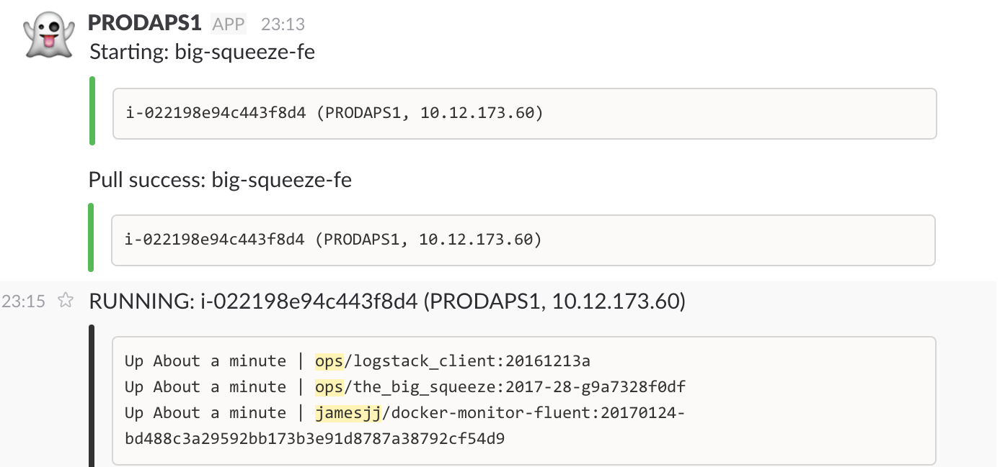
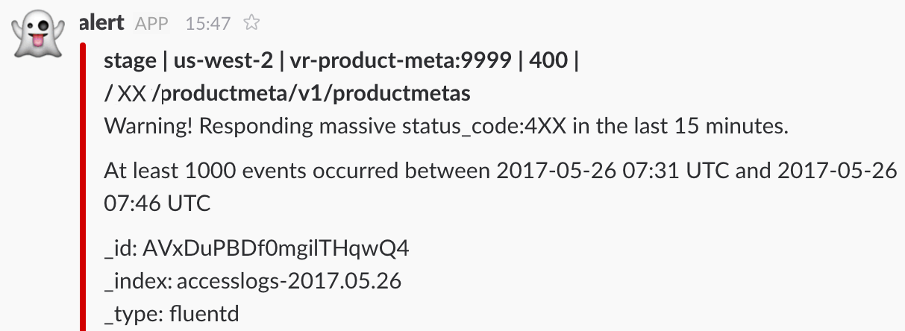

# Python script to show changes in Docker Swarm status

## Idea

Every `<n-seconds>` use docker python SDK to query docker swarm *services, nodes, containers* status (e.g. in docker v17.05.0-ce).

If there has been any *change* in the service status. Then post a message to Slack and/or Microsoft Teams.

*Important note* : purpose is to show *changes*, not the current state. This means the script must store some previous state information to compare with new state.

### Info/SDK links

  * Docker Python SDK:
      * <https://docker-py.readthedocs.io/en/stable/services.html#docker.models.services.ServiceCollection.list>
  * Docker API:
      * <https://docs.docker.com/engine/api/v1.29/#operation/ServiceList>
  * Slack Web Hooks:
      * <https://api.slack.com/incoming-webhooks>
  * Microsoft Teams:
      * Unofficial python library (use if you want, not required):
          * <https://github.com/rveachkc/pymsteams>
      * API:
          * <https://docs.microsoft.com/en-us/outlook/actionable-messages/actionable-messages-via-connectors> 
      * Message format testing:
          * <https://messagecardplayground.azurewebsites.net/>

## Requirements

### Technical requirements

  * Script must NOT write anything to disk. All data should be in-memory, or integrate with an external key-value store ==> Redis (if you integrate with Redis, all keys must have a configurable global prefix, because Redis may be shared with other services)

  * Must run on python 2.7 or python 3.5, inside Alpine linux docker container. Here is a [simple example of a periodic python task script](https://github.com/JamesJJ/python-periodic-task-example).

  * Which changes cause alerts to be sent should be configurable (see "Interesting alerts" section below)

  * Alerts of different types should have a different colour

  * Alerts sent to Slack / Teams must be beautiful, and clearly show what the change is.

  * Send to Slack or Teams or both, should be configurable.

  * All configuration should be set by using Environment Variables, or by reading from a YAML file.

#### Interesting alerts

Not all changes should cause alerts. Which changes cause alerts should be configurable. Here is a list of alerts that will definitely be required:

  * "Black" alert:
    * New node has appeared that did not exist before
    * Swarm node status ==> drain
    * Swarm node role change 

  * "Green" alert:
    * New service has appeared that did not exist before (and UpdateStatus is null or "completed")
    * UpdateStatus ==> completed

  * "Yellow" alert:
    * UpdateStatus ==> updating
    * Any change in "TaskTemplate" settings. This includes:
      * Environment variable config
      * Args config
      * Resource limits / reservations config

  * "Blue" alert:
    * Change in Mode (replicated / global / number of replicas)
    * Change in EndpointSpec ( vip / other)
    * Change in RollbackConfig

  * "Red" alert:
    * Service has disappeared
    * UpdateStatus ==> paused
    * Swarm node has disappeared
    * Swarm node status ==> pause
    * Any Container in status "restarting" or "dead"

#### What is a "beautiful" alert?

##### This is acceptable:

##### This needs improvement:

### Success requirements

* Python script, that matches requirements listed above. No bugs.

* Logging to console, using python native `logging` module (logging at appropriate log levels, see example link above)

* Extremely good exception and error handling

* PEP8 coding standard (see README in example link above)

* Dockerfile to build working docker image

* Documentation (table of environment variables, etc)
